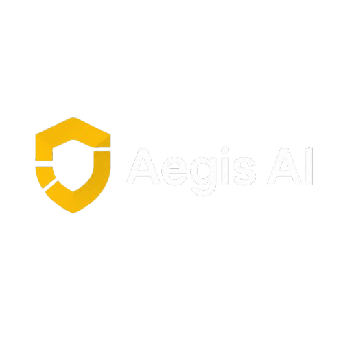

<p align="center">
  
</p>


<h1 align="center">Aegis AI</h1>

<p align="center">
An Enterprise AI Platform for Technical Support powered by RAG, AI Agents and Model Context Protocol (MCP).
</p>

<p align="center">


</p>

---

# Overview

Aegis AI is an enterprise-oriented AI platform designed to demonstrate modern AI Engineering practices.

The project combines Retrieval-Augmented Generation (RAG), AI Agents, Tool Calling, and the Model Context Protocol (MCP) to build an intelligent technical support assistant capable of understanding documentation, interacting with enterprise systems, and assisting users through natural language.

This project is being developed as a portfolio project to showcase scalable software architecture, modern AI development, and production-ready engineering practices.

---

# Project Goals

- Build a production-ready AI architecture
- Implement an advanced RAG pipeline
- Develop autonomous AI Agents
- Integrate external tools using MCP
- Support multi-tenant organizations
- Secure AI interactions through RBAC and approval workflows
- Demonstrate AI observability and evaluation

---

# Planned Features

### Authentication

- JWT Authentication
- User Registration
- Organizations
- Role-Based Access Control

### Knowledge Base

- PDF Upload
- DOCX Support
- Markdown Support
- Automatic Chunking
- Embeddings
- Vector Search

### AI Chat

- Conversational Assistant
- Source Attribution
- Conversation History
- Streaming Responses

### AI Agents

- Tool Calling
- Autonomous Reasoning
- External Integrations
- Approval Workflows

### MCP

- MCP Server
- Secure Tool Execution
- Extensible Tool Registry

### Observability

- Request Monitoring
- Token Usage
- Cost Estimation
- Performance Metrics

---

# Planned Architecture

```
                    React Frontend

                           │

                     FastAPI Backend

                           │

        ┌──────────────────┼──────────────────┐

        │                  │                  │

     Authentication      AI Agent         RAG Pipeline

        │                  │                  │

        └──────────────┬───┴──────────────────┘

                       │

                  MCP Tool Server

                       │

        ┌──────────────┼──────────────┐

        │              │              │

     Knowledge      Ticketing      External APIs

                       │

        PostgreSQL • Redis • Qdrant
```

---

# Technology Stack

## Frontend

- React
- TypeScript
- Tailwind CSS
- shadcn/ui

## Backend

- Python
- FastAPI
- SQLAlchemy
- Alembic

## Artificial Intelligence

- RAG
- AI Agents
- MCP
- Tool Calling
- LLMs
- Embeddings

## Databases

- PostgreSQL
- Qdrant
- Redis

## Infrastructure

- Docker
- Docker Compose

---

# Project Structure

```
aegis-ai/

├── backend/
│   ├── app/
│   ├── api/
│   ├── auth/
│   ├── agents/
│   ├── rag/
│   ├── mcp/
│   └── core/
│
├── frontend/
│
├── docs/
│
├── docker/
│
├── tests/
│
└── README.md
```

---

# Development Roadmap

## Phase 1

- [ ] Authentication
- [ ] Organizations
- [ ] PostgreSQL
- [ ] React Frontend
- [ ] Docker Environment

## Phase 2

- [ ] Document Upload
- [ ] RAG Pipeline
- [ ] AI Chat
- [ ] Conversation History

## Phase 3

- [ ] AI Agents
- [ ] MCP Integration
- [ ] Tool Calling
- [ ] Approval Workflows

## Phase 4

- [ ] Observability
- [ ] AI Evaluation
- [ ] Multi-model Routing
- [ ] Production Deployment

---

# Current Status

🚧 This project is currently under active development.

The initial focus is on building a clean, scalable architecture that will support advanced AI capabilities in future iterations.

---

# Author

**Rodrigo Faria**

AI Engineering • Software Engineering • Cybersecurity
